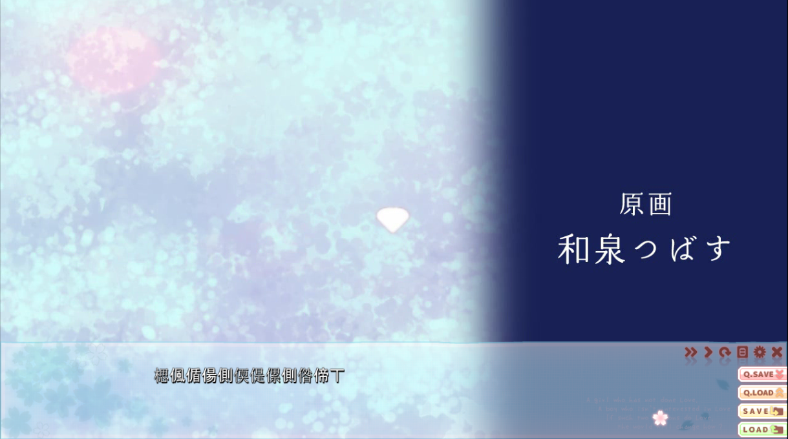

## 乱码
---

乱码指替代预期显示字符的无意义的字符。产生原因一般为使用的[解码]方式不正确，或是原始二进制流并非文本编码（例如，将图片以文本方式解码出现的乱码）。

---
### 常见乱码种类及解决
  +   
  *最为常见的乱码,不全，需补充*

  提示：在报错信息中出现乱码，也可以尝试以对应的解决方式解决。
  ---

  + 繁体码
    +   
    *游戏：恋がさくころ桜どき，系统：win10，非unicode语言：中文*  

    大多数符号为无意义的繁体字，夹杂“丄”与“丅”，是以gbk读取shift-jis编码的文本产生的乱码。事实上，“丄”的gbk编码为0x8141，在shift-jis中此编码对应“。”。而“丅”对应“，”。

    + 解决：
      + （windows）将设置->语言->管理语言设置->管理->非unicode程序中所使用的当前语言改为日语(日本)。注意设置非unicode语言后，需重启设备才能生效。
      + 使用转区软件[转日语区](转区.md)。

  ---

  + 口字码

    事实上，以utf-8读取GBK/shift-jis编码的文本，最常出现的符号为图中的黑色菱形中置白色问号（不同系统显示可能有所区别）。包含大量口字的乱码，更可能因字体缺失产生。

    + 
    *游戏：あなたに恋する恋愛ルセット，系统：win10，非unicode语言：日语。请注意图中黑色菱形和下方大段空白都是因使用utf-8读取shift-jis产生*

    + 解决：
      + （windows）关闭设置->语言->管理语言设置->管理->更改系统区域设置->beta版：使用unicode UTF-8提供全球语言支持。重启设备后生效。

  ---

  + 片假码

    + 
    *游戏：サクラノ詩－櫻の森の上を舞う－，系统：win10，非unicode语言：日语*

    大多数符号为小写片假名，是以shift-jis读取gbk编码的文本产生的乱码。

    + 解决：
      + （windows）将设置->语言->管理语言设置->管理->非unicode程序中所使用的当前语言改为中文(简体，中国)。注意设置非unicode语言后，需重启设备才能生效。
      + 使用转区软件[转简中区](转区.md)。 

